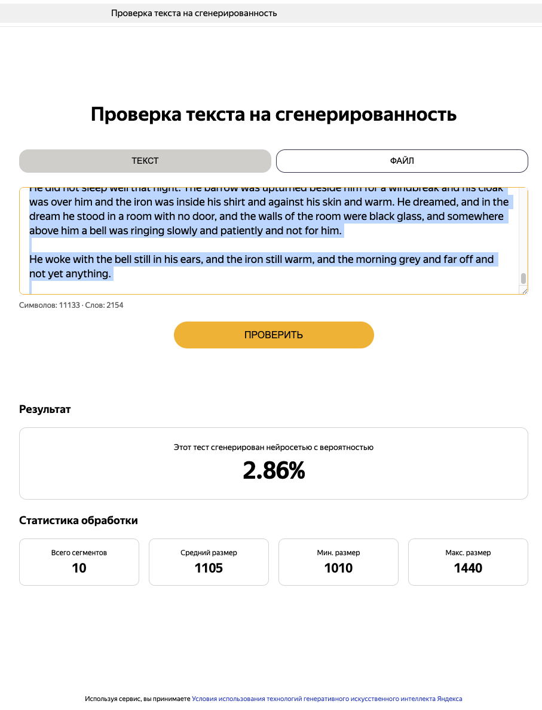
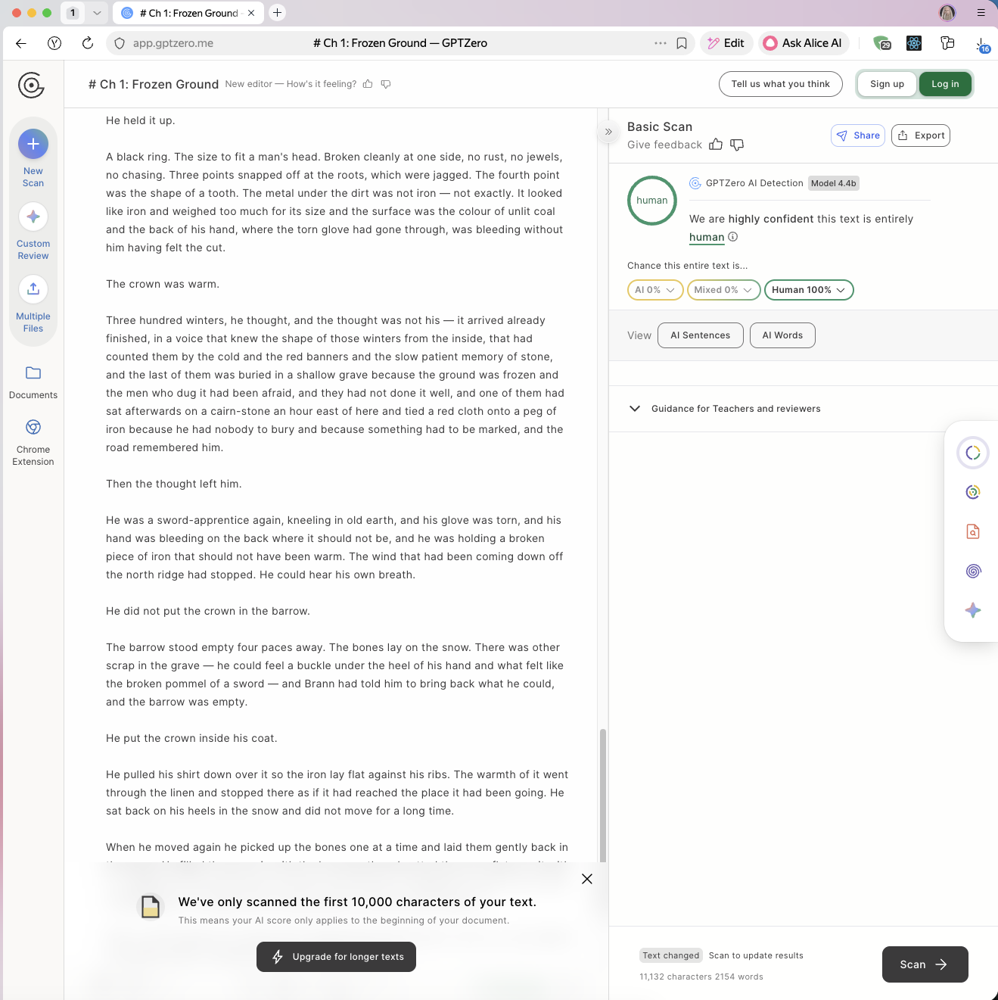

# autonovel

Autonomous fantasy-novel pipeline built as a Claude Code project — skills,
subagents, and slash commands instead of a Python script. Same modify →
evaluate → keep/discard loop, applied to fiction; same five-layer
co-evolving structure (voice / world / characters / outline / chapters,
plus canon).

**Scope.** Phases 1–3: foundation → drafting → automated revision → Opus
review. Art, audiobook, ePub, landing page, and LaTeX typesetting are out
of scope.

> ⚠️ **Token cost.** A full run from seed to Phase 3b finish takes several
> hours and burns serious tokens (Opus review is the heaviest step).
> Inspect [`examples/ashen-crown/`](examples/ashen-crown/) first to see
> what intermediate artifacts look like before committing to a run.

## Install

### 1. Clone

```bash
git clone https://github.com/tchr-dev/autonovel.git
cd autonovel
```

### 2. Open the directory in Claude Code

```bash
claude
```

### 3. Pre-approve permissions (optional but recommended)

Suppresses prompts during the multi-hour run:

```bash
cp .claude/settings.example.json .claude/settings.local.json
```

### 4. Ready

Skills under `.claude/skills/` and slash commands under `.claude/commands/`
are auto-discovered.

No API key is required for the pipeline itself — Claude Code provides the
LLM. `.env.example` is preserved only for users who want to run the
standalone Python helpers in `scripts/` against the Anthropic API
directly.

## Quick start

In Claude Code:

```bash
/autonovel my-novel-tag
```

This will:

1. Create `novels/my-novel-tag/` and initialise state.
2. Ask for a seed concept (or invoke the `seed` skill to generate options).
   The root [`seed.txt`](seed.txt) is a drop-in template you can edit.
3. Run Phase 1 (Foundation) until `foundation_score > 7.5 AND lore_score > 7.0`.
4. Run Phase 2 (Drafting) chapter by chapter until all are above 6.0.
5. Run Phase 3a (Automated revision cycles) until scores plateau.
6. Run Phase 3b (Opus review loop) until no major unqualified items remain.

State persists in `novels/<tag>/state.json`. Resume with
`/autonovel-resume <tag>`.

## Worked example

[`examples/ashen-crown/`](examples/ashen-crown/) is a real partial run —
foundation complete, one chapter drafted, evaluation logs intact. Browse
it to see what each phase produces, or copy it into `novels/` and resume:

```bash
cp -r examples/ashen-crown novels/ashen-crown
# Then in Claude Code:
/autonovel-resume ashen-crown
```

The seed that produced this run lives at both
[`seed.txt`](seed.txt) (repo root, as a template) and
[`examples/ashen-crown/seed.txt`](examples/ashen-crown/seed.txt).

### AI-detection results — Chapter 1 (`ashen-crown`)

The output of this pipeline is built specifically to dodge the structural
and lexical tells that fire AI detectors. The first drafted chapter of
the worked example was run through two public detectors:

| Detector | Sample | Result | Screenshot |
|---|---|---|---|
| [Yandex Neurodetector](https://yandex.ru/lab/neurodetector) | 2,154 words / 11,133 chars / 10 segments | **2.86%** AI-generated probability | <a href="docs/images/detector-yandex-ch01.png"></a> |
| [GPTZero](https://gptzero.me/) (Model 4.4b) | 2,154 words / first 10,000 chars scanned | **AI 0% · Mixed 0% · Human 100%** — "highly confident this text is entirely human" | <a href="docs/images/detector-gptzero-ch01.png"></a> |

The framework references in [`framework/ANTI-SLOP.md`](framework/ANTI-SLOP.md)
and [`framework/ANTI-PATTERNS.md`](framework/ANTI-PATTERNS.md), combined
with the regex `slop_scan.py` pass and the reader-panel evaluation, are
what drive these numbers down. Detector scores are not a quality
guarantee, but they're a useful sanity check that the prose has avoided
the obvious AI fingerprints.

## Layout

```text
.claude/
  skills/                       # the LLM-driven steps Claude executes
    autonovel/                  # top-level orchestrator
    seed/
    foundation/                 # gen-world, gen-characters, gen-outline,
                                # gen-canon, voice-discovery
    drafting/                   # draft-chapter
    evaluation/                 # evaluate-{foundation,chapter,full},
                                # adversarial-edit, compare-chapters,
                                # voice-fingerprint
    revision/                   # gen-brief, gen-revision, reader-panel,
                                # opus-review, apply-cuts
  agents/                       # personas spawned as subagents
    panel-{editor,genre-reader,writer,first-reader}.md
    literary-critic.md
    professor-of-fiction.md
  commands/                     # slash commands
    autonovel.md, autonovel-resume.md
  settings.example.json         # pre-approved permissions for unattended runs

scripts/                        # mechanical (no LLM)
  slop_scan.py                  # regex slop scanner
  apply_cuts.py                 # quote-match cut applicator
  voice_fingerprint.py          # quantitative voice analysis
  build_manuscript.py           # concatenate chapters
  parse_review.py               # parse Opus review markdown
  state.py                      # state.json read/update
  results_log.py                # append to results.tsv

framework/                      # immutable craft references
  CRAFT.md
  ANTI-SLOP.md                  # word-level AI tell detection
  ANTI-PATTERNS.md              # structural AI pattern detection
  voice-guardrails.md           # universal voice rules (Part 1)

templates/                      # copied per novel
  voice.md                      # full skeleton (Part 1 + blank Part 2)
  world.md, characters.md, outline.md, canon.md, MYSTERY.md
  state.json

examples/                       # committed worked runs (read-only references)
  ashen-crown/                  # foundation done + 1 chapter drafted

novels/<tag>/                   # one per novel run (gitignored)
  seed.txt
  voice.md, world.md, characters.md, outline.md, canon.md, MYSTERY.md
  chapters/ch_01.md, ch_02.md, …
  arc_summary.md, manuscript.md
  state.json, results.tsv
  edit_logs/                    # adversarial cuts, panel JSON, tournament
  eval_logs/                    # evaluate-* outputs
  reviews/                      # Opus review markdown + parsed JSON
  briefs/                       # revision briefs
  .snapshots/                   # phase-level rollback points
```

## Design notes

- **Skills replace LLM-calling Python scripts.** No httpx boilerplate, no
  JSON parsing, no model-name configuration. Claude executes the writing
  and evaluation directly.
- **Subagents replace persona-prompted httpx calls.** Each reader-panel
  persona and each Opus reviewer runs as an isolated subagent context —
  independent reasoning, no cross-contamination.
- **`novels/<tag>/` directories replace per-novel git branches.** Snapshots
  are explicit, taken at phase transitions and before risky rewrites. No
  `git reset --hard` for "discard"; restore from `.snapshots/` instead.
- **State is JSON, not git history.** Resume from `state.json`.

## Pipeline shape

- The five-layer co-evolving structure (voice / world / characters / outline / chapters + canon)
- Two immune systems: mechanical regex (`slop_scan.py`) + LLM judge (`evaluate-*` skills)
- Reader panel of four personas, with consensus / disagreement detection
- Opus dual-persona review loop with stopping conditions
- Adversarial "cut 500 words" pass
- Swiss-tournament Elo ranking of chapters

## Hand-running individual skills

```bash
# Foundation
gen-world, gen-characters, gen-outline, gen-canon, voice-discovery
evaluate-foundation

# Drafting
draft-chapter (per chapter)
evaluate-chapter

# Revision
adversarial-edit (per chapter or all)
apply-cuts (mechanical)
compare-chapters (tournament)
voice-fingerprint (mechanical)
reader-panel (4 subagents)
gen-brief, gen-revision
opus-review (2 subagents)
```

## Models

Skills assume an Opus-class model is available for Phase 3b review and a
Sonnet-class model for drafting/evaluation. On a Haiku-only plan expect
degraded prose and weaker review signal.

## License

MIT — see [LICENSE](LICENSE).
